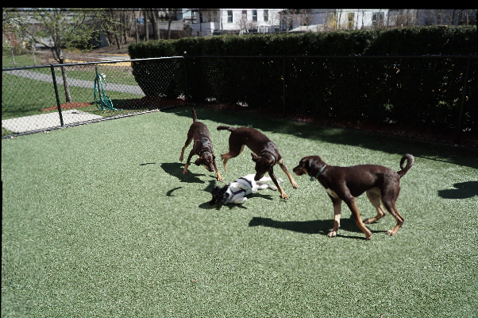
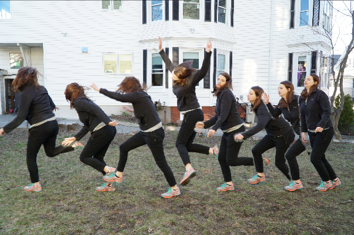

# StutterStitcher
Automatically generate action sequence panoramas from videos or image sequences
 
### Requirements
* Python 2.7 or 3.x
* OpenCV
* NumPy
* Glob
### Usage
```
python stutterstitcher.py [-h] [-fgo FOREGROUND_OBJECTS] [-s SCALE] [-r RATE] data
positional arguments:
  data                  Path to image folder or video file

optional arguments:
  -h, --help            show this help message and exit
  -fgo FOREGROUND_OBJECTS, --foreground-objects FOREGROUND_OBJECTS
                        Number of foreground objects in scene (default: 1)
  -s SCALE, --scale SCALE
                        Scale input images by factor (default: 0.2)
  -r RATE, --rate RATE  Frame resampling rate (e.g. 3 means keep 1 in 3
                        frames) (default: 3)
```
Rate is really the most important parameter to set, and should generally be 3-4 for image bursts, or 10-25 for video (these are rough estimates)
### Credits
* [Sean Chen, Ben Stabler, and Andrew Stanley. Automatic Generation of Action Sequence Images from Burst Shots. 2013](https://stacks.stanford.edu/file/druid:yt916dh6570/Chen_Stabler_Stanley_Action_Sequence_Generation.pdf)